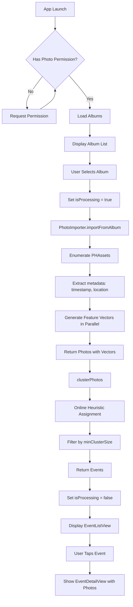

# AI Photo Album Architecture

## System Overview

AI Photo Album is an iOS application that automatically organizes photos into events using online heuristic-based clustering based on temporal proximity and geographical location.

## High-Level Architecture

```
┌─────────────────────────────────────────────────────────────────┐
│                         ContentView                              │
│  (Main coordinator - manages app state and navigation)           │
└────────────┬────────────────────────────────────────────────────┘
             │
             ├─ Permission Gate → Request photo library access
             │
             ├─ Album Selection → List of user albums + smart albums
             │
             ├─ Processing Screen → "Processing album..." indicator
             │
             └─ Event Display → EventListView → EventDetailView
```

## Data Flow



## Clustering Algorithm

### Algorithm Type
**Online Heuristic-Based Cluster Assignment**

### Process Flow

```
Input: Array of Photos with metadata (timestamp, location)
Output: Array of Events (photo clusters)

1. Sort photos by timestamp (chronological order)
2. Initialize empty active cluster list
3. For each photo in chronological order:
   a. Filter clusters to eligible candidates (within time/location windows)
   b. Score each eligible cluster using affinity function
   c. If best score ≥ assignmentThreshold:
      - Add photo to best cluster
      - Update cluster centroids incrementally (O(1))
   d. Else:
      - Create new cluster with this photo
   e. Prune clusters outside active time window
4. Convert clusters to immutable Events
5. Filter: Keep only events with ≥ minClusterSize photos
6. Return: Array of Event objects
```

### Eligibility Gate (O(1) Check)

```
eligible(photo, cluster) = {
    abs(photo.timestamp - cluster.timeCentroid) ≤ maxTimeWindow
    AND (
        photo.location == (0,0)  // Missing location sentinel
        OR cluster.locationCentroid == (0,0)
        OR distance(photo.location, cluster.locationCentroid) ≤ maxLocationDistance
    )
}
```

### Affinity Score Calculation

```
affinity(photo, cluster) =
    timeWeight × exp(-|Δt| / timeDecayTau)
    + locationWeight × exp(-distance / locationDecaySigma)
    + sizeWeight × log(1 + cluster.photos.count)

where:
    Δt = abs(photo.timestamp - cluster.timeCentroid)  // seconds
    distance = meters between photo.location and cluster.locationCentroid

Decay parameters:
    timeDecayTau (τ): Controls time sensitivity (default: 3600 seconds = 1 hour)
    locationDecaySigma (σ): Controls location sensitivity (default: 10000 meters = 10 km)

Weights:
    timeWeight: Importance of temporal proximity (default: 0.6)
    locationWeight: Importance of spatial proximity (default: 0.3)
    sizeWeight: Preference for larger clusters (default: 0.1)
```

### Incremental Centroid Update (O(1))

```
When adding photo to cluster with n existing photos:

timeCentroid_new = (timeCentroid_old × n + photo.timestamp) / (n + 1)

locationCentroid_new = CLLocation(
    latitude: (lat_old × n + lat_new) / (n + 1),
    longitude: (lon_old × n + lon_new) / (n + 1)
)

startTime_new = min(startTime_old, photo.timestamp)
endTime_new = max(endTime_old, photo.timestamp)
```

### Configuration Parameters

| Parameter | Default | Description |
|-----------|---------|-------------|
| `maxTimeWindow` | 3600 seconds (1 hour) | Maximum time difference for eligibility |
| `maxLocationDistance` | 10000 meters (10 km) | Maximum location distance for eligibility |
| `timeWeight` | 0.6 | Weight for temporal affinity component |
| `locationWeight` | 0.3 | Weight for spatial affinity component |
| `sizeWeight` | 0.1 | Weight for cluster size preference |
| `timeDecayTau` | 3600 seconds (1 hour) | Exponential decay rate for time |
| `locationDecaySigma` | 10000 meters (10 km) | Exponential decay rate for location |
| `assignmentThreshold` | 0.5 | Minimum affinity score to assign to cluster |
| `minClusterSize` | 3 | Minimum photos required to form an event |

## Architecture Components

### Views

```
ContentView (Root)
├── Permission Request UI
├── Album List (List of PHAssetCollections)
├── Processing Indicator
└── EventListView
    └── EventRowView (for each Event)
        └── [Sheet] EventDetailView
            └── LazyVGrid
                └── PhotoThumbnailView (for each Photo)
```

#### ContentView
**File**: `ai-photo-album/Views/ContentView.swift`

**Responsibilities**:
- Root navigation coordinator
- Manages app state through AlbumViewModel
- Implements conditional view rendering based on state

**State Logic**:
```swift
if isProcessing {
    show "Processing album..."
} else if !events.isEmpty {
    show EventListView
} else if albums.isEmpty {
    show "Loading albums..." + load albums
} else {
    show album selection list
}
```

#### EventListView
**File**: `ai-photo-album/Views/EventListView.swift`

**Responsibilities**:
- Display list of events
- Handle event selection
- Present EventDetailView as modal sheet

**Features**:
- NavigationTitle: "Events"
- List with EventRowView for each event
- Sheet presentation for event details

#### EventDetailView
**File**: `ai-photo-album/Views/EventDetailView.swift`

**Responsibilities**:
- Display event metadata
- Show photo grid
- Handle photo thumbnails

**Layout**:
- LazyVGrid with adaptive columns (minimum 100pt)
- 10pt spacing between items
- PhotoThumbnailView for each photo

### ViewModels

#### AlbumViewModel
**File**: `ai-photo-album/ViewModels/AlbumViewModel.swift`

**Annotation**: `@MainActor` (ensures UI thread safety)

**Published Properties**:
```swift
@Published var albums: [PHAssetCollection] = []
@Published var photos: [Photo] = []
@Published var isProcessing = false
@Published var events: [Event] = []
```

**Methods**:
- `loadAlbums()`: Fetches albums from PhotoLibraryService
- `selectAlbum(_ album: PHAssetCollection) async`: Orchestrates import → clustering pipeline

**Pipeline**:
```
selectAlbum(album)
    ↓
isProcessing = true
    ↓
photos = await PhotoImporter.importFromAlbum(album)
    ↓
events = await clusterPhotos(photos)
    ↓
isProcessing = false
```

### Models

#### Photo
**File**: `ai-photo-album/Models/Photo.swift`

```swift
struct Photo: Identifiable {
    let id: UUID
    let timestamp: Date
    let location: CLLocation
    let phAsset: PHAsset?
    var vector: [Float]?  // Feature vector (generated but not used in current clustering)
}
```

#### Event
**File**: `ai-photo-album/Models/Event.swift`

```swift
struct Event: Identifiable {
    let id: UUID
    let startTime: Date
    let endTime: Date
    let centralLocation: CLLocation  // Weighted centroid
    let photos: [Photo]
}
```

#### ClusteringConfig
**File**: `ai-photo-album/Models/ClusteringConfig.swift`

```swift
struct ClusteringConfig {
    let maxTimeWindow: TimeInterval
    let maxLocationDistance: Double
    let timeWeight: Double
    let locationWeight: Double
    let sizeWeight: Double
    let timeDecayTau: TimeInterval
    let locationDecaySigma: Double
    let assignmentThreshold: Double
    let minClusterSize: Int

    static let `default` = ClusteringConfig(
        maxTimeWindow: 3600,
        maxLocationDistance: 10_000,
        timeWeight: 0.6,
        locationWeight: 0.3,
        sizeWeight: 0.1,
        timeDecayTau: 3600,
        locationDecaySigma: 10_000,
        assignmentThreshold: 0.5,
        minClusterSize: 3
    )
}
```

### Services

#### PhotoLibraryService
**File**: `ai-photo-album/Services/PhotoLibraryService.swift`

**Responsibilities**:
- Request photo library authorization
- Fetch user albums and smart albums

**Key Functions**:
```swift
func requestAuthorization() async -> PHAuthorizationStatus
func fetchAlbums() -> [PHAssetCollection]
```

**Album Types Fetched**:
- `.album` (user-created albums)
- `.smartAlbum` (system albums like Recents, Favorites)

#### PhotoImporter
**File**: `ai-photo-album/Services/PhotoImporterService.swift`

**Responsibilities**:
- Import photos from PHAssetCollection
- Extract metadata (timestamp, location)
- Generate feature vectors using Vision framework
- Parallel processing with TaskGroup

**Key Functions**:
```swift
static func importFromAlbum(_ album: PHAssetCollection) async -> [Photo]
private static func generateFeatureVector(for asset: PHAsset?) async -> [Float]?
private static func loadImage(from asset: PHAsset) async -> UIImage?
private static func generateFeatureVector(from image: UIImage) async -> [Float]?
```

**Feature Vector Generation**:
1. Load image from PHAsset (299x299 target size)
2. Create VNGenerateImageFeaturePrintRequest
3. Execute request with VNImageRequestHandler
4. Extract Data from VNFeaturePrintObservation
5. Convert Data to [Float] using unsafe pointer operations

**Parallel Processing**:
```swift
await withTaskGroup(of: (Int, [Float]?).self) { group in
    for (index, photo) in photos.enumerated() {
        group.addTask {
            let vector = await generateFeatureVector(for: photo.phAsset)
            return (index, vector)
        }
    }
    for await (index, vector) in group {
        photos[index].vector = vector
    }
}
```

#### ClusteringService
**File**: `ai-photo-album/Services/ClusteringService.swift`

**Responsibilities**:
- Implement online heuristic-based cluster assignment
- Manage active cluster window
- Calculate photo-to-cluster affinity scores
- Incrementally update cluster centroids
- Filter by minimum cluster size

**Key Functions**:
```swift
func clusterPhotos(_ photos: [Photo], config: ClusteringConfig) async -> [Event]
private func isEligible(photo: Photo, cluster: ClusterBuilder, config: ClusteringConfig) -> Bool
private func calculateAffinity(photo: Photo, cluster: ClusterBuilder, config: ClusteringConfig) -> Double
private func findBestCluster(for photo: Photo, among clusters: [ClusterBuilder], config: ClusteringConfig) -> ClusterBuilder?
```

**Internal ClusterBuilder Class**:
```swift
private class ClusterBuilder {
    let id: UUID
    var photos: [Photo]
    var timeCentroid: Date
    var locationCentroid: CLLocation
    var startTime: Date
    var endTime: Date

    init(firstPhoto: Photo)
    func addPhoto(_ photo: Photo)  // O(1) incremental update
    func toEvent() -> Event        // Convert to immutable Event
}
```

**Assignment Strategy**:
```swift
For each photo (chronologically):
1. Filter clusters: isEligible(photo, cluster) → time + location window check
2. Score clusters: calculateAffinity(photo, cluster) → exp decay scoring
3. Find best: argmax(affinity) among eligible clusters
4. If affinity ≥ threshold:
   - Add photo to best cluster
   - Update centroids incrementally
5. Else:
   - Create new single-photo cluster
6. Prune clusters outside time window
```

## Device-Specific Behavior

### Physical iOS Device
- **Vision Framework**: ✅ Fully functional
- **Feature Vectors**: Generated for all photos
- **Clustering Mode**: Time + location based (vectors generated but not used)
- **Affinity Range**: [0, ~1.5] (timeScore + locationScore + sizeScore)

### iOS Simulator
- **Vision Framework**: ❌ Espresso context error
- **Feature Vectors**: All nil
- **Clustering Mode**: Time + location based (identical to device)
- **Affinity Range**: [0, ~1.5] (identical to device)

**Note**: The current clustering algorithm uses only temporal and spatial data. Visual feature vectors are still generated by PhotoImporter for potential future use (graph-based refinement, visual similarity scoring), but are not currently used in the clustering process. Both simulator and device produce identical clustering results based on time and location metadata.

## Performance Optimizations

1. **O(n log n) Clustering Complexity**:
   - Sort: O(n log n) using Swift's Timsort
   - Assignment: O(n · k) where k = active clusters (typically 5-20)
   - Expected speedup: 50-400x faster than previous O(n²) hierarchical clustering

2. **Active Window Pruning**:
   - Only maintains clusters within maxTimeWindow of current photo
   - Prevents unbounded memory growth
   - Typical memory: 5-20 clusters regardless of album size

3. **Incremental Centroid Updates**:
   - O(1) running average calculation
   - No recomputation over all photos in cluster
   - Formula: `new = (old × n + value) / (n + 1)`

4. **Parallel Vector Generation**:
   - TaskGroup processes all photos concurrently
   - Vectors generated but not used in current clustering (future enhancement)

5. **Lazy Loading**:
   - LazyVGrid in EventDetailView for memory efficiency
   - Photos loaded on-demand during scrolling

6. **Eligibility Gate**:
   - O(1) check before expensive affinity calculation
   - Filters candidates by time/location windows
   - Typical reduction: 100 clusters → 5-10 eligible

## State Management

```
┌─────────────────────────────────────────────────────────┐
│                   AlbumViewModel                         │
│                     (@MainActor)                         │
│                                                          │
│  State: albums, photos, events, isProcessing            │
│                                                          │
│  Actions:                                                │
│    - loadAlbums()                                        │
│    - selectAlbum(album) async                           │
└─────────────────────────────────────────────────────────┘
             │                           │
             ↓                           ↓
    [@Published updates]        [Async operations]
             │                           │
             ↓                           ↓
      [SwiftUI Views]          [Services: PhotoImporter,
       Auto-refresh             ClusteringService]
```

## Dependencies

### Apple Frameworks
- **Photos**: PHPhotoLibrary, PHAssetCollection, PHAsset, PHImageManager
- **Vision**: VNGenerateImageFeaturePrintRequest, VNFeaturePrintObservation (vectors generated but not used in clustering)
- **CoreLocation**: CLLocation, coordinate calculations, distance measurements
- **Foundation**: Date operations, TimeInterval, exponential/logarithmic functions
- **UIKit**: UIImage for image processing
- **SwiftUI**: UI framework
- **Combine**: @Published properties for reactive updates

### Privacy Requirements
**Info.plist entries**:
- `NSPhotoLibraryUsageDescription`: Required for photo library access
- `NSPhotoLibraryAddUsageDescription`: Required for write access (future feature)

## Error Handling

### Vision Framework Errors
- **Espresso context failure**: Expected on simulator, silently ignored
- **Image loading failure**: Returns nil vector (vectors not used in clustering, no impact)

### Photo Library Errors
- **Permission denied**: Shows permission gate, requests authorization
- **Empty albums**: Shows "Loading albums..." until albums load
- **No events formed**: Adjustable via `assignmentThreshold`, `maxTimeWindow`, `maxLocationDistance`, or `minClusterSize`

### Clustering Edge Cases
- **Missing locations**: (0,0) sentinel detected, location checks skipped
- **Dense data**: All photos assigned to growing cluster (size preference)
- **Sparse data**: Each photo creates new cluster, most filtered by minClusterSize
- **Identical timestamps**: Clustering proceeds based on location and size

## Future Enhancements

### Potential Improvements
1. **Graph-based refinement** (Step 2 of migration):
   - Build photo similarity graph using visual embeddings
   - Apply community detection or graph cuts
   - Refine cluster boundaries based on visual similarity
   - Merge/split clusters using graph connectivity

2. **Visual similarity affinity component**:
   - Add visual score to affinity calculation
   - Use pre-generated feature vectors from PhotoImporter
   - Formula: `+ visualWeight × (1 - cosineDistance(photo.vector, cluster.vectorCentroid))`

3. **Adaptive thresholds**:
   - Auto-tune based on photo density
   - Learn optimal parameters from user feedback
   - Different thresholds for different time periods

4. **Scene detection**:
   - Use VNClassifyImageRequest for event naming
   - Classify events as "Beach Day", "Birthday Party", etc.
   - Use scene categories to refine clustering

5. **Face clustering**:
   - Group by people using VNDetectFaceRectanglesRequest
   - Create person-specific event views
   - Use face similarity as additional affinity component

6. **Persistent storage**:
   - Cache feature vectors to CoreData (avoid regeneration)
   - Save computed events for instant loading
   - Background sync when photo library changes

7. **Manual adjustments**:
   - Allow users to merge/split events
   - Drag photos between events
   - Adjust cluster boundaries

8. **Event naming**:
   - Auto-generate titles based on location/time/content
   - Reverse geocoding for location names
   - Smart titles: "Weekend in Paris", "Morning Hike"

9. **Export**: Share events as albums or collections

### Scalability Considerations
- **Large albums**: Current O(n log n) complexity scales well to 10,000+ photos
- **Memory**: Active window pruning keeps memory constant (5-20 clusters)
- **Caching**: Feature vectors already generated, can be persisted for reuse
- **Performance**: Expected sub-second clustering for albums up to 5,000 photos

## Diagnostic Logging

### Current Logging Points
1. `📊 Clustering X photos with online heuristic assignment` - Clustering start
2. `✅ Assigned X photos, created Y clusters` - Assignment completion
3. `📦 After filtering (min size X): Y events` - Final event count after filtering
4. `🎨 Generated X/Y feature vectors` - Vector generation summary from PhotoImporter

## File Structure

```
ai-photo-album/
├── Models/
│   ├── Photo.swift
│   ├── Event.swift
│   └── ClusteringConfig.swift
├── ViewModels/
│   └── AlbumViewModel.swift
├── Views/
│   ├── ContentView.swift
│   ├── EventListView.swift
│   └── EventDetailView.swift
├── Services/
│   ├── PhotoLibraryService.swift
│   ├── PhotoImporterService.swift
│   └── ClusteringService.swift
└── Info.plist
```

## Configuration Tuning Guide

### Too Few Events (Most photos filtered out)
**Symptoms**: Many small clusters, most filtered by minClusterSize

**Solutions**:
- ✅ Decrease `assignmentThreshold` (0.5 → 0.3) - Make assignment more lenient
- ✅ Increase `maxTimeWindow` (3600 → 7200) - Consider photos further apart in time
- ✅ Increase `maxLocationDistance` (10000 → 20000) - Consider photos further apart spatially
- ✅ Decrease `minClusterSize` (3 → 2) - Allow smaller events
- ✅ Increase `sizeWeight` (0.1 → 0.2) - Favor growing existing clusters

### Too Many Events (Over-segmentation)
**Symptoms**: Photos split into many small events that should be together

**Solutions**:
- ✅ Decrease `assignmentThreshold` (0.5 → 0.3) - More aggressive assignment
- ✅ Increase `maxTimeWindow` (3600 → 7200) - Wider eligibility window
- ✅ Increase `maxLocationDistance` (10000 → 20000) - Wider spatial window
- ✅ Increase weight decay rates: `timeDecayTau` (3600 → 7200), `locationDecaySigma` (10000 → 20000)

### Too Few Events (Under-segmentation)
**Symptoms**: Unrelated photos grouped into same event

**Solutions**:
- ✅ Increase `assignmentThreshold` (0.5 → 0.7) - Stricter assignment
- ✅ Decrease `maxTimeWindow` (3600 → 1800) - Tighter eligibility window
- ✅ Decrease `maxLocationDistance` (10000 → 5000) - Tighter spatial window
- ✅ Decrease weight decay rates: `timeDecayTau` (3600 → 1800), `locationDecaySigma` (10000 → 5000)

### Event Type-Specific Tuning

**Tight Events** (weddings, concerts, meetings):
```swift
maxTimeWindow: 1800         // 30 minutes
maxLocationDistance: 1000   // 1 km
assignmentThreshold: 0.6    // Stricter
```

**Loose Events** (vacations, road trips, day outings):
```swift
maxTimeWindow: 86400        // 24 hours
maxLocationDistance: 100000 // 100 km
assignmentThreshold: 0.3    // Looser
```

**Location-Prioritized** (city tours, hiking):
```swift
timeWeight: 0.3
locationWeight: 0.6
sizeWeight: 0.1
```

**Time-Prioritized** (time-lapse, sequential activities):
```swift
timeWeight: 0.7
locationWeight: 0.2
sizeWeight: 0.1
```

### Testing Strategy
- **Simulator**: Works identically to device (time + location only)
- **Sample albums**: Test with known event boundaries (vacation, party, etc.)
- **Iterative tuning**: Adjust one parameter at a time
- **Console logs**: Monitor assignment counts and filtered results
